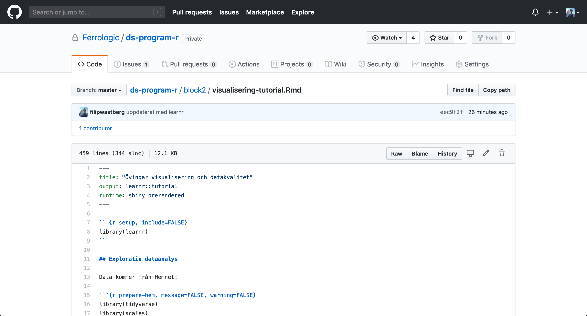

```{r setup, include=FALSE}
knitr::opts_chunk$set(echo = TRUE)
```

När vi drog igång DS-programmet i maj var det under helt andra omständigheter än vanligt. Helt plöstligt skulle all utbildning ske online via Zoom. 

Det här ställde särskilt höga krav på deltagare och instruktörer i de block där deltagarna lär sig programmering. Att lära sig programmera är en av de viktigaste kunskaperna deltagarna i DS-programmet får med sig. Modern Data Science bygger på programmering och vill man kalla sig Data Scientist behöver man kunna använda ett programmeringsspråk.

Men många av deltagarna på DS-programmet har aldrig programmerat förut. De flesta gör mycket av sitt jobb i Excel och kan en del SQL. Men vissa har aldrig jobbat mot en databas förut. För dessa personer är DS-programmet särskilt utmanande. Det var det innan Covid-19-pandemin men distansundervisning gjorde det inte lättare för dem.

I den första versionen av DS-programmet skötte inte vi på Ferrologic utbildningen utan varje deltagare gick en kurs i programmering parallellt. När vi tog över programmeringsundervisningen gav vi dem i princip bara skript som de skulle köra igenom på sin dator. Det senaste året har vi istället gett deltagarna Notebooks där text varvas med kod. Att arbeta i en Notebook är en viktig vana för en Data Scientist. Det tvingar oss att dokumentera det vi gör och gör dessutom våra analyser och modeller mer reproducerbara. Men det kan vara svårt att förstå Notebooks för en nybörjare, eftersom de inte har sett något alternativ. 

För att göra introduktionen till programmering ännu enklare utvärderar vi nu ett paket för att göra tutorials i R som heter `learnr. 

`learnr` tar en Rmarkdown-notebook och gör om den till en interaktiv tutorial i vilken vi kan ge *hints*, *solutions*, lägga in videos och göra `quizes`.

Dessa tutorials, som kan handla om allt från att connecta till ett företags databaser, eller visa hur modeller och KPI-beräkningar fungerar, kan också integreras i RStudio om man exempelvis har RStudio Server Pro tillgängligt i sin organisation.

Du installerar enkelt `learnr` genom:

```{r eval=FALSE}
install.packages("learnr")
```

Efter att du installerat, och startat om RStudio, kan du klicka på `File -> New File -> R Markdown...` och sedan välja `Interactive Tutorial` bland tillgängliga templates så får du ett skelett för en tutorial.


```{r echo=FALSE}
library(knitr)

```

När du får upp dokumentet kan du klicka på `Run Document`.

```{r echo=FALSE}

```

Det R Markdown-dokument som du ser ovan blir då renderat till en interaktiv tutorial i vilken man kan skriva R-kod.

```{r echo=FALSE}

```

Som sagt finns det även stöd för att göra quiz, ge rätt svar, hints m.m.

Vill du se en riktig implementation av det här finns den på vår Github för DS-programmet:

```{r echo=FALSE}

```

Och renderad ser det ut så här:

```{r echo=FALSE}

```

/ Filip


